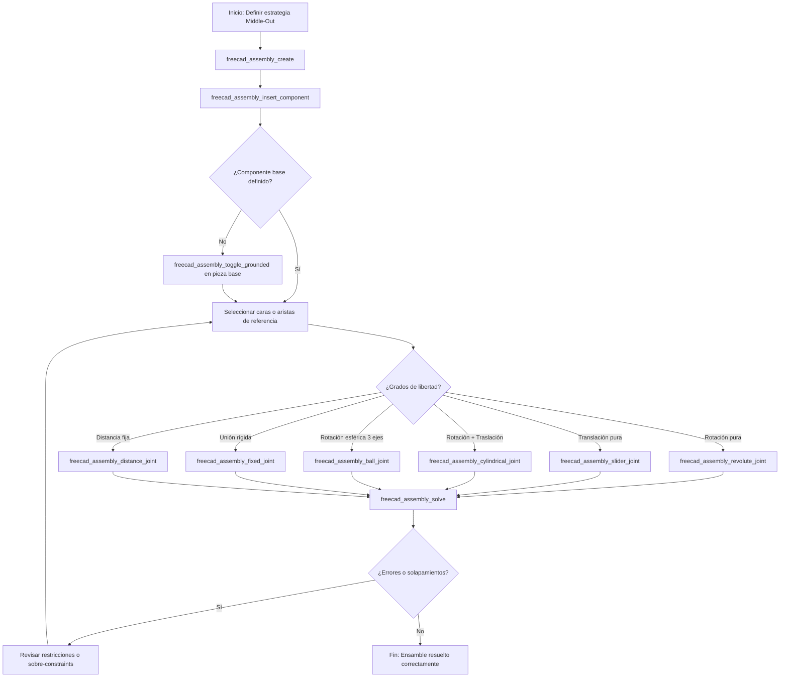

> Dependencia obligatoria: freecad-core. Cargar primero `freecad-core` para que el servidor MCP esté activo.

# FreeCAD Assembly Skill

Modelado y vinculación cinemática de conjuntos mecánicos con el módulo nativo Assembly y Ondsel solver en FreeCAD 1.1+.

## 1. Flujo principal (Mermaid graph TD)



## 2. Decisiones y ramas (SI/ENTONCES)

Árbol de selección de joints según los grados de libertad deseados entre dos componentes:

- Si necesitas bloquear todo movimiento relativo (unión soldada o atornillada fija) -> Usar `freecad_assembly_fixed_joint` (0 DOF).
- Si necesitas permitir rotación pura alrededor de un eje cilíndrico (bisagra, perno) -> Usar `freecad_assembly_revolute_joint` (1 DOF rotacional).
- Si necesitas permitir traslación lineal pura a lo largo de un eje (guía, pistón) -> Usar `freecad_assembly_slider_joint` (1 DOF translacional).
- Si necesitas permitir rotación y traslación combinadas sobre el mismo eje (eje deslizante) -> Usar `freecad_assembly_cylindrical_joint` (2 DOF).
- Si necesitas permitir rotación libre en los tres ejes espaciales (rótula esférica) -> Usar `freecad_assembly_ball_joint` (3 DOF rotacionales).
- Si necesitas fijar una separación métrica exacta entre caras o puntos de referencia -> Usar `freecad_assembly_distance_joint` (restricción escalar).

## 3. Workflow operativo (tool calls concretos)

Secuencia exacta para armar cualquier conjunto mecánico aplicando gobierno transaccional:

1. Iniciar transacción de seguridad con `freecad_begin_transaction` o capturar snapshot con `freecad_snapshot_document`.
2. Crear contenedor de ensamble:
   ```json
   {
     "name": "MecanismoPrincipal"
   }
   ```
   Tool: `freecad_assembly_create`
3. Insertar componentes desde las piezas modeladas:
   ```json
   {
     "assemblyName": "MecanismoPrincipal",
     "objectName": "EjeBase",
     "x": 0,
     "y": 0,
     "z": 0
   }
   ```
   Tool: `freecad_assembly_insert_component`
4. Fijar el componente estructural de referencia en el espacio:
   ```json
   {
     "assemblyName": "MecanismoPrincipal",
     "componentName": "EjeBase_Link"
   }
   ```
   Tool: `freecad_assembly_toggle_grounded`
5. Vincular piezas adicionales aplicando joints específicos (ejemplo revolute para bisagra):
   ```json
   {
     "assemblyName": "MecanismoPrincipal",
     "component1": "EjeBase_Link",
     "element1": "CylindricalFace1",
     "component2": "Brazo_Link",
     "element2": "CylindricalFace1",
     "name": "BisagraBrazo"
   }
   ```
   Tool: `freecad_assembly_revolute_joint`
6. Resolver las restricciones del sistema:
   ```json
   {
     "assemblyName": "MecanismoPrincipal"
   }
   ```
   Tool: `freecad_assembly_solve`
7. Verificar estado y confirmar transacción con `freecad_commit_transaction` (o abortar con `freecad_abort_transaction` si el solver diverge).

## 4. Gates de validación (obligatorios)

| Criterio Objetivo | Tool de Verificación | Acción Correctiva si Falla |
|-------------------|----------------------|----------------------------|
| Componente base grounded | Inspección de joints / solver status | Aplicar `freecad_assembly_toggle_grounded` al componente estructural principal. |
| Solver sin divergencias | `freecad_assembly_solve` | Aislar último joint añadido, revisar selección de caras coaxiales y reintentar. |
| Sin solapamientos físicos | `freecad_get_object_info` | Ajustar cotas en hoja `Parametros` o modificar restricciones de distancia. |

## 5. Tabla de fallas comunes

| Síntoma o Error | Causa Raíz | Mitigación Obligatoria |
|-----------------|------------|------------------------|
| El solver diverge o arroja error de cálculo | Restricciones contradictorias o falta de grados de libertad coherentes (over-constraint). | Ejecutar rollback transaccional con `freecad_abort_transaction`, eliminar el último joint añadido y verificar que los elementos seleccionados sean geométricamente compatibles. |
| Componente flotante o desubicado | Falta de anclaje inicial con grounded o enlace desvinculado del contenedor. | Asegurar que al menos una pieza tenga un joint `Grounded` activo antes de resolver el sistema de joints. |
| Error de referencia de elemento geométrica | Cambio topológico en la pieza subyacence (ej. pad renombrado o cara recreada). | Mantener nombres estables en features o aplicar nombres de caras persistentes antes de ensamblar. |

## 6. Anti-patrones (PROHIBIDO)

- PROHIBIDO anclar múltiples componentes con grounded de forma simultánea e innecesaria. Esto genera sobre-constraints insolubles en el solver.
- PROHIBIDO intentar definir joints sin antes tener un componente debidamente grounded. El sistema quedará flotando sin referencia espacial válida.
- PROHIBIDO usar joints genéricos o incorrectos que ignoren los grados de libertad reales del mecanismo.
- PROHIBIDO mezclar wrappers MCP con ejecución arbitraria de Python en la misma sesión para alterar el árbol de joints sin control transaccional.

## 7. Checklist final

- [ ] Contenedor de ensamble creado con `freecad_assembly_create`.
- [ ] Componentes vinculados mediante `freecad_assembly_insert_component`.
- [ ] Al menos un componente base anclado con `freecad_assembly_toggle_grounded`.
- [ ] Joints aplicados acorde a los grados de libertad reales.
- [ ] Solver ejecutado exitosamente con `freecad_assembly_solve` sin errores en consola.
- [ ] Verificación visual de ausencia de solapamientos mecánicos.

## 8. References

- `docs/METODOLOGIA_CAD_FREECAD.md` — Metodología general de modelado y transaccionalidad.
- `docs/GUIA_BUENAS_PRACTICAS_CAD.md` — Guía de buenas prácticas para diseño paramétrico y ensamblajes.
- Documentación interna del módulo Assembly de FreeCAD (Ondsel solver).
