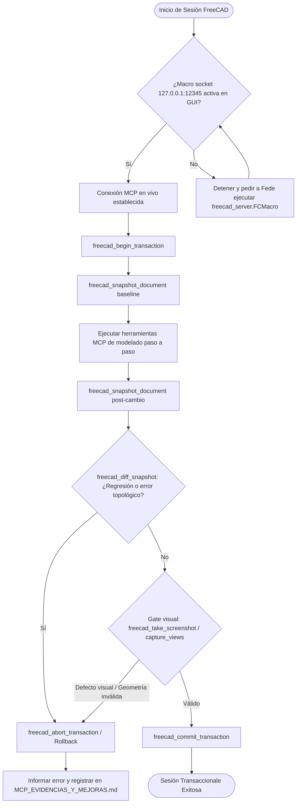

# Skill Base: FreeCAD Core

Esta skill es el punto de entrada obligatorio y universal para **cualquier interacción o tarea que involucre FreeCAD**. Define los fundamentos transversales de conexión, gobierno transaccional, ejecución de herramientas y validación para todas las demás skills del ecosistema (`freecad-parametric-part`, `freecad-assembly`, `freecad-tolerances`, `freecad-dfam`, `freecad-gears`, `freecad-robotic-joints`, `freecad-stress-analysis`).

## 1. Flujo principal (Mermaid graph TD)



## 2. Decisiones y ramas (SI/ENTONCES)

| Bifurcación | Condición | Acción Obligatoria |
|---|---|---|
| **Conexión GUI** | El socket en `127.0.0.1:12345` no responde | Detener ejecución, solicitar a Fede iniciar `freecad_server.FCMacro`. No degradar a headless sin autorización explícita. |
| **Gobierno Transaccional** | `freecad_diff_snapshot` detecta pérdida de volumen, reducción inesperada de BBox o error en features | Ejecutar `freecad_abort_transaction` inmediatamente. Nunca dejar el documento en estado corrupto. |
| **Impacto de Modificación** | Cambio clasificado como nivel M5 (modificación estructural radical que rompe dependencias previas) | Detenerse y consultar a Fede (stop-and-confirm). Aplicar la regla de la skill `freecad-modification`. |
| **Gaps de Herramientas** | La tool requerida no existe en el catálogo MCP o falla de forma estructural | No inventar scripts arbitrarios de Python (`freecad_execute_python`). Gatillar la skill `mcp-freecad-automejora` y registrar en `docs/MCP_EVIDENCIAS_Y_MEJORAS.md`. |

## 3. Workflow operativo (tool calls concretos)

1. **Verificar y conectar**: Establecer conexión socket con la GUI de FreeCAD mediante el servidor MCP.
2. **Iniciar transacción**: 
   ```json
   { "tool": "freecad_begin_transaction", "args": { "name": "FeatureSession" } }
   ```
3. **Tomar snapshot baseline**: 
   ```json
   { "tool": "freecad_snapshot_document", "args": { "docName": "Unnamed" } }
   ```
4. **Ejecutar operaciones incrementales**: Invocación iterativa de tools especializadas de sketch, part design, operaciones, etc.
5. **Tomar snapshot posterior y comparar**:
   ```json
   { "tool": "freecad_snapshot_document", "args": { "docName": "Unnamed" } },
   { "tool": "freecad_diff_snapshot", "args": { "docName": "Unnamed" } }
   ```
6. **Inspección visual complementaria (Opcional/Automática)**:
   ```json
   { "tool": "freecad_take_screenshot", "args": { "viewName": "Isometric", "filePath": "/tmp/preview.png" } }
   ```
7. **Cierre transaccional**: 
   - Si todo es correcto: `freecad_commit_transaction`.
   - Si hay fallas: `freecad_abort_transaction`.

## 4. Gates de validación (obligatorios)

- **Gate Numérico y Topológico**: 
  - *Criterio*: BoundBox válido (dimensiones positivas no nulas), volumen positivo coherente, sin excepciones de FreeCAD.
   - *Tool*: `freecad_diff_snapshot` y `freecad_get_object_info`.
  - *Acción si falla*: `freecad_abort_transaction` + rollback al snapshot baseline.
- **Gate Visual**:
  - *Criterio*: Ausencia de auto-intersecciones visibles, caras volteadas o artefactos extraños en el viewport.
  - *Tool*: `freecad_take_screenshot` / `freecad_capture_views`.
  - *Acción si falla*: `freecad_abort_transaction` y revisión geométrica del sketch o pad.
- **Gate de Cobertura y Automejora**:
  - *Criterio*: Todas las operaciones invocadas pertenecen al set oficial de tools del MCP.
  - *Tool*: Verificación estricta de nombres de tools.
  - *Acción si falla*: Iniciar `mcp-freecad-automejora` y documentar en `docs/MCP_EVIDENCIAS_Y_MEJORAS.md`.

## 5. Tabla de fallas comunes

| Síntoma / Error | Causa Raíz | Mitigación Obligatoria |
|---|---|---|
| `ConnectionRefusedError` en puerto 12345 | La macro `freecad_server.FCMacro` no está corriendo en la GUI de FreeCAD de Fede. | Pedir a Fede que ejecute la macro desde el menú Macro > Macros... en FreeCAD. No usar headless sin permiso. |
| Feature tree corrompido por mezcla de scripts y wrappers | Uso arbitrario de `freecad_execute_python` intercalado con llamadas de módulos de PartDesign. | Respetar vía única interactiva MCP. Usar transacciones y snapshots para aislar cambios. |
| Regresión silenciosa de geometría tras un corte/pad | Modificación topológica que altera los nombres internos de las caras (topological naming problem). | Envolver siempre en `freecad_begin_transaction` / `freecad_diff_snapshot` y abortar ante anomalías en BBox. |

## 6. Anti-patrones (PROHIBIDO)

- **PROHIBIDO** mezclar llamadas a wrappers MCP con scripts arbitrarios de Python (`freecad_execute_python`) en la misma sesión sin un aislamiento estricto.
- **PROHIBIDO** continuar modelando cuando falla la conexión al socket sin consultar explícitamente a Fede.
- **PROHIBIDO** omitir el uso de snapshots y transacciones en operaciones complejas de ensamblaje o modelado paramétrico.
- **PROHIBIDO** inventar soluciones ad-hoc sin registrar el gap correspondiente en `docs/MCP_EVIDENCIAS_Y_MEJORAS.md`.

## 7. Checklist final

- [ ] ¿La conexión a la GUI de FreeCAD está activa mediante el macro socket?
- [ ] ¿Se inició la transacción con `freecad_begin_transaction` y se tomó el snapshot baseline?
- [ ] ¿Se validó el resultado numérico y topológico mediante `freecad_diff_snapshot`?
- [ ] ¿Se realizó el gate visual con captura de pantalla o vistas?
- [ ] ¿Se cerró la transacción con `freecad_commit_transaction` (o `freecad_abort_transaction` en caso de error)?

## 8. References

- Documento maestro de metodología: `docs/METODOLOGIA_CAD_FREECAD.md` (Secciones 5 y 6: Gobierno Transaccional y Control de Regresiones).
- Registro de evidencias y mejoras: `docs/MCP_EVIDENCIAS_Y_MEJORAS.md`.
- Módulo de estado y transacciones: `src/tools/state.ts` (7 tools).
- Módulo de visualización: `src/tools/view.ts` (2 tools).
