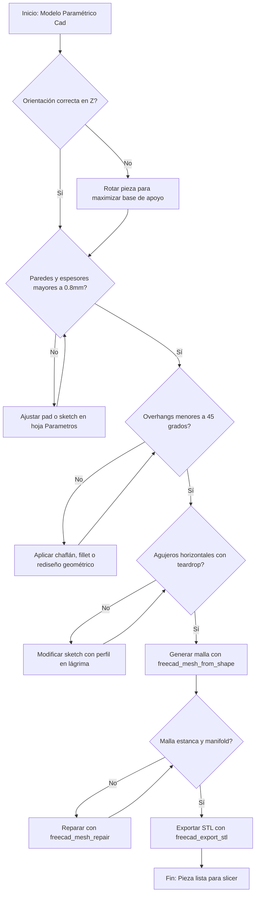

> Dependencia obligatoria: freecad-core. Cargá `freecad-core` antes de usar esta skill para asegurar que el servidor MCP esté conectado.

# Skill: FreeCAD DfAM (Design for Additive Manufacturing)

Esta skill guía la revisión y validación paramétrica de piezas orientadas a fabricación aditiva (impresión 3D FDM/SLA) mediante herramientas MCP, garantizando integridad estructural, mínimo uso de soportes y estanqueidad de mallas.

## 1. Flujo principal (Mermaid graph TD)

## 2. Decisiones y ramas (SI/ENTONCES)

| Bifurcación / Condición | Si es FALSO (No) | Si es VERDADERO (Sí) |
|---|---|---|
| Orientación en Z | Reorientar cara principal hacia la base caliente | Mantener posición y avanzar a verificación de paredes |
| Espesor de pared ≥ 0.8mm | Ajustar parámetros en hoja o rediseñar croquis | Avanzar a verificación de voladizos (overhangs) |
| Overhangs < 45 grados | Agregar chaflán o fillet de transición autoportante | Avanzar a verificación de agujeros horizontales |
| Agujeros horizontales | Aplicar perfil en lágrima (teardrop) en croquis | Avanzar a conversión de malla |
| Malla manifold / estanca | Ejecutar reparación automatizada de defectos | Proceder a exportación de archivo STL |

## 3. Workflow operativo (tool calls concretos)

1. **Inspección geométrica inicial**:
   - `freecad_get_bounding_box(objectName="PiezaBase")` para verificar dimensiones externas.
   - `freecad_measure_distance(...)` para validar distancias clave.
2. **Generación de malla de control**:
   - `freecad_mesh_from_shape(objectName="PiezaBase", linearDeflection=0.1, angularDeflection=30, name="MallaControl")`
3. **Inspección y diagnóstico de malla**:
   - `freecad_mesh_info(meshName="MallaControl")` para verificar volumen, áreas y recuento de facetas.
4. **Reparación de defectos topológicos**:
   - `freecad_mesh_repair(meshName="MallaControl", fillHoles=true, removeDuplicates=true, fixNormals=true)` si la malla presenta discontinuidades.
5. **Exportación final para fabricación**:
   - `freecad_export_stl(objectNames=["PiezaBase"], filePath="/path/to/output.stl")`

## 4. Gates de validación (obligatorios)

- **Gate 1 - Espesor de pared**: Verificar que ninguna sección sea menor a 0.8mm (equivalente a 3 perímetros de nozzle de 0.4mm).
  - *Tool*: `freecad_get_bounding_box` o inspección de croquis.
  - *Acción si falla*: Modificar la dimensión en la hoja `Parametros` (M1) y reconstruir el modelo.
- **Gate 2 - Overhangs**: Comprobar que no existan voladizos superiores a 45 grados sin soporte.
  - *Tool*: `freecad_get_face_info`.
  - *Acción si falla*: Incorporar chaflanes o rediseñar con puentes de transición.
- **Gate 3 - Estanqueidad de Malla**: Asegurar cero caras abiertas o duplicadas antes de exportar.
  - *Tool*: `freecad_mesh_info` y `freecad_mesh_repair`.
  - *Acción si falla*: Ejecutar `freecad_mesh_repair` con relleno de agujeros y normalización de caras.

## 5. Tabla de fallas comunes

| Síntoma / Error | Causa raíz | Mitigación obligatoria |
|---|---|---|
| Pared fina o incompleta | Espesor menor a 0.8mm (menos de 3 perímetros) | Ajustar sketch con cotas paramétricas mínimas de 0.8mm |
| Colapso en voladizos | Overhang mayor a 45 grados sin soporte físico | Rediseñar con perfil en lágrima o agregar chaflán de 45 grados |
| Malla no manifold o abierta | Errores topológicos en conversión de sólido a malla | Ejecutar `freecad_mesh_repair` con `fillHoles=true` y `fixNormals=true` |

## 6. Anti-patrones (PROHIBIDO)

- **PROHIBIDO** diseñar paredes menores a 0.8mm en extrusiones principales para nozzle de 0.4mm.
- **PROHIBIDO** dejar agujeros pasantes horizontales perfectamente circulares sin perfil en lágrima.
- **PROHIBIDO** exportar mallas sin verificar previamente su estado manifold con `freecad_mesh_info`.
- **PROHIBIDO** configurar rellenos al 100% (infill total) generando acumulación excesiva de calor y warping.

## 7. Checklist final

- [ ] Orientación en Z optimizada con la base más amplia sobre la cama.
- [ ] Espesor de pared verificado en todas las secciones mayor o igual a 0.8mm.
- [ ] Voladizos (overhangs) limitados a menos de 45 grados o con chaflanes de soporte.
- [ ] Agujeros horizontales diseñados con perfil en lágrima (teardrop).
- [ ] Malla generada, inspeccionada y reparada mediante herramientas MCP.
- [ ] Archivo STL exportado correctamente con ruta absoluta validada.

## 8. References

- Guía de Buenas Prácticas CAD: `docs/GUIA_BUENAS_PRACTICAS_CAD.md`
- Metodología CAD FreeCAD: `docs/METODOLOGIA_CAD_FREECAD.md`
- Módulo Mesh de FreeCAD: `src/tools/mesh.ts`
- Módulo Import/Export: `src/tools/import-export.ts`
