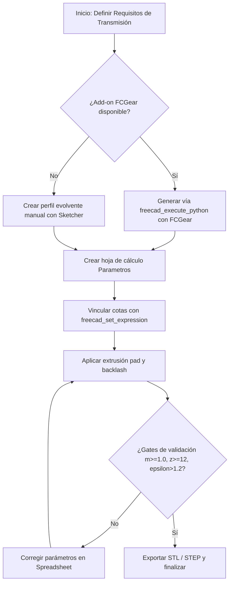

> ⚠️ **Dependencia obligatoria**: `freecad-core`. Cargar la skill base antes de operar con herramientas `freecad_*`.

# Skill: FreeCAD Gears (Diseño y Transmisiones Mecánicas)

Guía operativa para el diseño paramétrico de engranajes y transmisiones mecánicas en FreeCAD optimizados para impresión 3D FDM.

---

## 1. Flujo Principal

---

## 2. Decisiones y Ramas (SI / ENTONCES)

| Condición / Bifurcación | Si es Verdadero (Sí) | Si es Falso (No) |
|---|---|---|
| **¿FCGear disponible?** | Automatiza la creación del evolvente mediante scripts Python avanzados con `freecad_execute_python`. | Requiere croquizado manual de la evolvente con `freecad_create_sketch` y arcos tangentes. |
| **¿Módulo m < 1.0?** | Rechazado de inmediato; viola el límite de resolución de impresión FDM. | Válido; se procede con el dimensionamiento. |
| **¿Número de dientes z < 12?** | Riesgo de interferencia y socavadura (undercut). Ajustar a z ≥ 12. | Geometría de dientes estable. |

---

## 3. Workflow Operativo (Tool Calls Concretos)

1. **Inicializar Documento y Parámetros**:
   - `freecad_new_document` (nombre: `"Transmision"`)
   - `freecad_spreadsheet_create` (nombre: `"Parametros"`)
   - `freecad_spreadsheet_set` (asignar `m = 2.0`, `z1 = 15`, `z2 = 30`, `j = 0.2`)
   - `freecad_spreadsheet_alias` (alias para celdas: `Mod`, `Z1`, `Z2`, `Backlash`)

2. **Generación del Engranaje (Camino FCGear o Manual)**:
   - Si FCGear está activo: `freecad_execute_python` con código de generación de engranaje recto parametrizado.
   - Si es manual: `freecad_create_sketch` sobre plano `XY`, agregado de primitivas geométricas y restricciones con `freecad_add_sketch_constraint`.

3. **Extrusión y Operaciones (PartDesign)**:
   - `freecad_pad` (extruir el croquis base con ancho de diente definido).
   - `freecad_export_stl` (generar malla para laminador).

---

## 4. Gates de Validación (Obligatorios)

- **Gate Módulo**: `m ≥ 1.0`. Si `m < 1.0`, abortar y escalar el módulo.
- **Gate Dientes**: `z ≥ 12`. Si `z < 12`, incrementar número de dientes para evitar socavadura.
- **Gate Relación de Contacto**: `ε > 1.2`. Verificar solapamiento continuo del perfil.
- **Gate Distancia entre Centros**: `a = m · (z₁ + z₂) / 2` calculada de forma exacta en la hoja `Parametros`.

---

## 5. Tabla de Fallas Comunes

| Síntoma / Error | Causa Raíz | Mitigación Obligatoria |
|---|---|---|
| **Bloqueo mecánico al acoplar** | Ausencia de backlash (`j`) para compensar expansión del filamento. | Incorporar juego lateral `j ≈ 0.1 + 0.05 · m` en la distancia entre centros o perfil. |
| **Rotura frágil por cizalladura** | Impresión vertical de los dientes sobre el eje Z (anisotropía intercapa). | Orientar siempre el engranaje acostado en el plano XY (impresión plana). |
| **Pérdida de geometría en flancos** | Uso de módulo inferior a 1.0 (`m < 1.0`) superando la resolución del nozzle (0.4 mm). | Elevar el módulo a un valor `m ≥ 1.0`. |

---

## 6. Anti-Patrones (PROHIBIDO)

- **PROHIBIDO** usar módulos menores a `1.0` en piezas FDM.
- **PROHIBIDO** omitir el backlash en transmisiones engranadas impresas en PLA o PETG.
- **PROHIBIDO** orientar el eje de rotación de los dientes perpendicular a la base de impresión sin soportes adecuados.

---

## 7. Checklist Final

- [ ] `m ≥ 1.0` verificado.
- [ ] `z ≥ 12` en piñón y rueda.
- [ ] Relación de contacto `ε > 1.2` comprobada.
- [ ] Backlash configurado según material (`PLA`, `PETG`, etc.).
- [ ] Orientación en plano XY para impresión FDM validada.

---

## 8. References

Consultar especificaciones detalladas y tablas completas de backlash en:
- `references/gears-formulas.md`
- `docs/METODOLOGIA_CAD_FREECAD.md` (§9)
