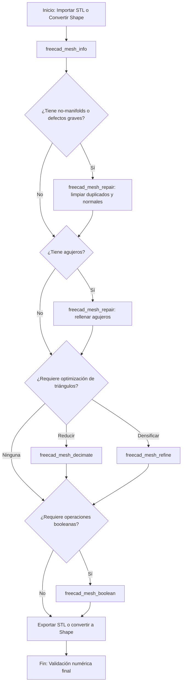

> Dependencia: freecad-core

# Diagnóstico y Reparación de Mallas en FreeCAD

Esta skill establece el protocolo estándar para la inspección, diagnóstico y reparación de mallas poligonales y mallas STL dentro del servidor MCP de FreeCAD, garantizando mallas limpias, manifold y aptas para impresión 3D o reconstrucción geométrica.

## 1. Flujo principal (Mermaid graph TD)

## 2. Decisiones y ramas (SI/ENTONCES)

| Bifurcación | Condición | Acción recomendada |
|-------------|-----------|--------------------|
| Defectos topológicos | `hasNonManifolds == true` o `hasSelfIntersections == true` | Ejecutar `freecad_mesh_repair` con `removeDuplicates: true` y `fixNormals: true`. |
| Presencia de agujeros | Conteo de bordes abiertos detectados en inspección | Ejecutar `freecad_mesh_repair` con `fillHoles: true`. |
| Exceso de resolución | Triángulos excesivos que ralentizan operaciones | Ejecutar `freecad_mesh_decimate` especificando el ratio de reducción deseado. |
| Baja resolución | Superficies facetadas con aristas muy largas | Ejecutar `freecad_mesh_refine` indicando la longitud máxima de arista. |
| Conversión geometría | Necesidad de editar CAD sobre un STL importado | Convertir la malla a sólido usando `freecad_mesh_to_shape` con costura activada. |

## 3. Workflow operativo (tool calls concretos)

1. **Importación o generación**:
   - `freecad_import_stl(filePath="/ruta/absoluta/pieza.stl")`
   - O alternativamente: `freecad_mesh_from_shape(objectName="Pad", linearDeflection=0.1)`

2. **Diagnóstico inicial**:
   - `freecad_mesh_info(meshName="pieza_mesh")`
   - Analizar métricas devueltas: vértices, facetas, volumen, `isSolid`, `hasNonManifolds`, `hasSelfIntersections`.

3. **Reparación de defectos**:
   - `freecad_mesh_repair(meshName="pieza_mesh", fillHoles=true, removeDuplicates=true, fixNormals=true)`

4. **Optimización y operaciones**:
   - `freecad_mesh_decimate(meshName="pieza_mesh", targetReduction=0.5)` (si reduce polígonos)
   - `freecad_mesh_boolean(mesh1Name="mesh1", mesh2Name="mesh2", operation="union")` (para fusiones de mallas)

5. **Exportación final**:
   - `freecad_export_stl(objectNames=["pieza_mesh"], filePath="/ruta/absoluta/resultado.stl")`

## 4. Gates de validación (obligatorios)

- **Criterio de solidez**: La malla resultante debe cumplir obligatoriamente con `isSolid == true` y `hasNonManifolds == false` antes de cualquier exportación o impresión 3D.
- **Tool de verificación**: `freecad_mesh_info` tras cada bloque de reparación.
- **Acción ante fallo**: Si persisten los defectos tras la reparación automática, aislar la zona afectada, aplicar decimación moderada para eliminar geometría corrupta y rellenar manualmente o reconstruir desde formas base con `freecad_mesh_to_shape`.

## 5. Tabla de fallas comunes

| Falla detectada | Síntoma en FreeCAD / Slicer | Causa raíz | Solución recomendada |
|-----------------|-----------------------------|------------|-----------------------|
| Malla no manifold | Error de slicing, inversión de caras | Aristas compartidas por más de dos caras o geometría autointersectada | Aplicar `freecad_mesh_repair` o reescribir la malla desde el modelo paramétrico original. |
| Agujeros abiertos | El slicer detecta paredes abiertas o volumen cero | Falta de facetas en regiones de transición o cortes incompletos | Ejecutar `freecad_mesh_repair` con `fillHoles: true` ajustando el límite de perímetro. |
| Normales invertidas | Zonas oscuras en el visor, caras hacia adentro | Orientación inconsistente de los vectores normales de los triángulos | Ejecutar `freecad_mesh_repair` con `fixNormals: true` para armonizar la orientación. |

## 6. Anti-patrones (PROHIBIDO)

- **PROHIBIDO**: Exportar mallas directamente a producción sin verificar previamente el estado `isSolid` mediante `freecad_mesh_info`.
- **PROHIBIDO**: Mezclar operaciones de modelado paramétrico nativo (`Part Design`) con modificaciones destructivas de malla sin un respaldo transaccional previo.
- **PROHIBIDO**: Aplicar decimaciones agresivas superiores al 90 por ciento (`targetReduction > 0.9`) en zonas funcionales con tolerancias mecánicas críticas.

## 7. Checklist final

- [ ] Importación o conversión completada correctamente.
- [ ] Diagnóstico ejecutado mediante `freecad_mesh_info`.
- [ ] Reparación aplicada eliminando duplicados y corrigiendo normales.
- [ ] Agujeros cerrados y mallas verificadas como manifold.
- [ ] Exportación a STL validada con métricas correctas.

## 8. References

- Documentación oficial de FreeCAD Workbench Mesh
- Guía metodológica interna de FreeCAD MCP (`docs/METODOLOGIA_CAD_FREECAD.md`)
- Especificaciones de diseño para manufactura aditiva (`docs/GUIA_BUENAS_PRACTICAS_CAD.md`)
