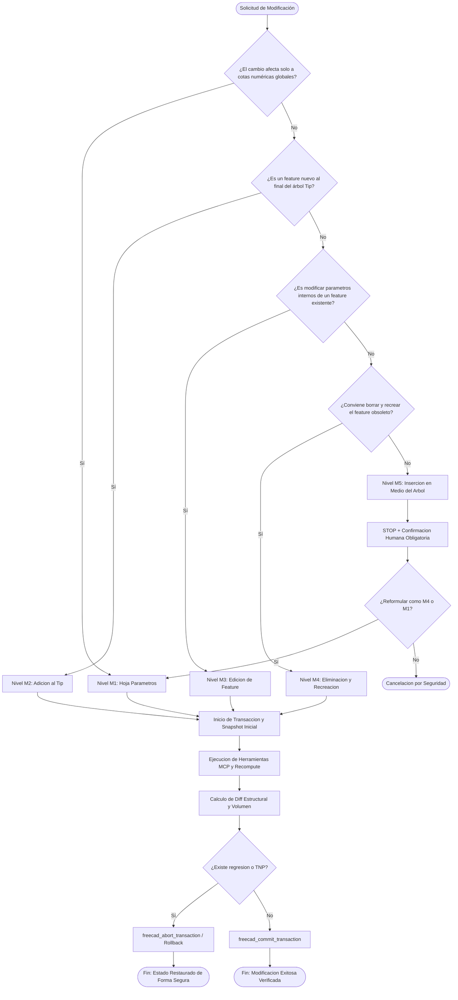

# Modificación de Piezas y Gobierno Transaccional en FreeCAD

> Dependencia: `freecad-core` (requiere el protocolo base de ejecución y control transaccional del servidor MCP).

---

## 1. Flujo principal (Clasificación M1-M5)

El siguiente diagrama detalla el proceso de decisión para clasificar y ejecutar cualquier modificación sobre una pieza paramétrica existente en FreeCAD, priorizando siempre la estabilidad topológica y el uso de la hoja de cálculo.

---

## 2. Decisiones y Ramas (SI / ENTONCES)

| Bifurcación | Condición de Evaluación | Decisión Operativa (SI) | Alternativa (NO / ENTONCES) |
|---|---|---|---|
| **M1: Paramétrica Pura** | ¿La cota modificada existe en la hoja `Parametros` y está enlazada por expresiones? | Actualizar celda con `freecad_spreadsheet_set` y recomputar. Cero riesgo topológico. | Si la cota no está parametrizada, registrar **deuda paramétrica** y proceder a M3 o M4. |
| **M2: Adición al Tip** | ¿Se agrega un corte, extrusión o redondeo al final del árbol actual? | Ejecutar feature sobre la cara activa del Tip actual. Riesgo mínimo de TNP. | Si el feature interfiere con geometrías previas, evaluar M3. |
| **M3: Edición de Feature** | ¿Se requiere cambiar profundidad, radio o parámetros internos de un feature existente? | Modificar propiedades del objeto y recomputar. Verificar índices de aristas en fillets. | Si rompe referencias cruzadas, migrar a M4. |
| **M4: Recreación** | ¿La modificación estructural es compleja y arruina croquis intermedios? | Borrar el feature problemático y recrearlo limpiamente sobre planos de referencia estables. | Si afecta a todo el componente, reestructurar desde la base. |
| **M5: Inserción Intermedia** | ¿Se pretende insertar un corte o croquis en medio del historial existente? | **STOP OBLIGATORIO**: prohibido ejecutar sin confirmación explícita de Fede (riesgo crítico de TNP). | Rediseñar el flujo como M4 o ajustar parámetros al final (M2). |

---

## 3. Workflow Operativo (Protocolo Transaccional)

Toda modificación de nivel M1 a M4 debe ejecutarse bajo un contenedor transaccional estricto utilizando las herramientas del módulo `state`:

1. **Apertura de Transacción**:
   - Iniciar la transacción con `freecad_begin_transaction(name="Modificacion_M[X]")`.
2. **Snapshot Baseline**:
   - Capturar el estado inicial con `freecad_snapshot_document(includeTopology=true)`.
3. **Ejecución y Recálculo**:
   - Aplicar las herramientas MCP necesarias (por ejemplo, `freecad_spreadsheet_set`, `freecad_pocket`, etc.).
   - Forzar el recálculo analítico del documento.
4. **Snapshot Posterior y Diff**:
   - Capturar el nuevo estado con `freecad_snapshot_document`.
   - Comparar estados utilizando `freecad_diff_snapshot(snapshotA=..., snapshotB=..., expectedChanges=["NombreObjeto"])`.
5. **Validación de Criterios**:
   - Verificar variación de volumen y caja contenedora (`freecad_get_volume`, `freecad_get_bounding_box`).
6. **Commit o Abort**:
   - Si el diff es limpio y los volúmenes coinciden con el diseño esperado, invocar `freecad_commit_transaction`.
   - Si se detecta cualquier regresión, pérdida de volumen o error de solver, invocar inmediatamente `freecad_abort_transaction`.

---

## 4. Gates de Validación Obligatorios

| Fase de Gate | Criterio Objetivo | Herramienta MCP Asociada | Acción Correctiva si Falla |
|---|---|---|---|
| **Gate 1: Pre-Modificación** | Existencia previa de snapshot y estado libre de errores previos. | `freecad_snapshot_document` | Abortar y limpiar documento activo. |
| **Gate 2: Estabilidad Topológica** | Ausencia de advertencias de caras huérfanas en el solver. | `freecad_diff_snapshot` | Ejecutar `freecad_abort_transaction` de inmediato. |
| **Gate 3: Integridad Geométrica** | Volumen y BoundBox dentro de la tolerancia admisible (Δ < 0.1%). | `freecad_get_volume`, `freecad_get_bounding_box` | Revisar cotas y recomputar. Si persiste, aplicar rollback. |

---

## 5. Tabla de Fallas Comunes

| Síntoma / Error | Causa Raíz | Mitigación Obligatoria |
|---|---|---|
| **Croquis roto tras recálculo (Sketch Red)** | Modificación de cotas base que elimina referencias geométricas o inversión de normales. | Reconstruir restricciones geométricas faltantes en el sketch con `freecad_add_sketch_constraint` y usar planos Datum fijos. |
| **Topological Naming Problem (TNP)** | Una operación posterior referenciaba una arista o cara cuyo ID interno cambió tras editar un feature intermedio. | Evitar referenciar caras numéricas directas (ej. Face4). Anclar operaciones a planos de referencia (Datum Planes) o acumular siempre sobre el Tip. |
| **Regresión de volumen inesperada** | Un corte (pocket) o extrusión (pad) intersecta incorrectamente la geometría tras un cambio paramétrico M1/M3. | Comparar con `freecad_diff_snapshot`, detectar la pérdida de masa y aplicar `freecad_abort_transaction`. |
| **Pocket o Hole que desaparece** | La profundidad del vaciado excede el espesor del sólido tras una reducción de cota en la hoja `Parametros`. | Vincular la profundidad del vaciado a expresiones dependientes del parámetro de espesor (ej. `Parametros.Espesor - 2mm`). |

---

## 6. Anti-Patrones (PROHIBIDO)

- **Modificación a ciegas sin snapshot**: Está terminantemente prohibido aplicar cambios estructurales sin abrir una transacción previa.
- **Ignorar el Nivel M5**: Forzar inserciones intermedias en el árbol sin confirmación humana destruye la trazabilidad topológica.
- **Referencias a caras efímeras**: Vincular operaciones a nombres de caras volátiles en lugar de planos Datum formales.
- **Mezcla de comandos arbitrarios de Python**: Usar `freecad_execute_python` para modificar el árbol de operaciones en lugar de las herramientas MCP tipadas del módulo `state` y `operations`.

---

## 7. Checklist Final

- [ ] ¿Se clasificó correctamente la modificación en la escala M1 a M5?
- [ ] ¿Se abrió la transacción con `freecad_begin_transaction` y se tomó snapshot baseline?
- [ ] ¿Se aplicaron los cambios respetando la regla de oro (M1 vía hoja `Parametros`)?
- [ ] ¿Se ejecutó `freecad_diff_snapshot` para validar ausencia de regresiones topológicas?
- [ ] ¿Se confirmó el commit (`freecad_commit_transaction`) o se realizó rollback (`freecad_abort_transaction`) ante fallas?
- [ ] ¿Se registró cualquier deuda paramétrica detectada en `docs/MCP_EVIDENCIAS_Y_MEJORAS.md`?

---

## 8. References

- Fuente de verdad de la escala M1-M5 y flujos transaccionales: `docs/METODOLOGIA_CAD_FREECAD.md` (Sección 6).
- Módulo de control de estado y transacciones del servidor MCP: `src/tools/state.ts`.
- Guía de buenas prácticas y mitigación de TNP: `docs/GUIA_BUENAS_PRACTICAS_CAD.md`.
