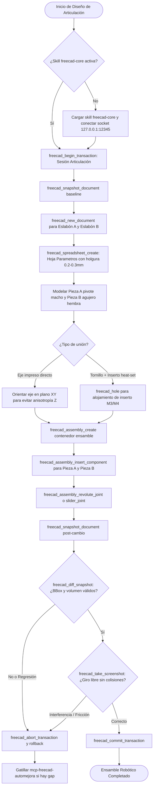

> ⚠️ **Dependencia obligatoria**: Esta skill requiere la skill base **`freecad-core`** para el gobierno transaccional de sesión y la conexión socket en vivo con la GUI de FreeCAD (`127.0.0.1:12345`). Usá `skill(name="freecad-core")` primero.

# FreeCAD Robotic Joints & Mechanisms

Guía y procedimiento canónico para diseñar mecanismos robóticos, brazos, linkages, eslabones y articulaciones móviles optimizados para impresión 3D FDM utilizando el servidor MCP de FreeCAD y el módulo nativo de ensamblaje (Ondsel solver).

## 1. Flujo principal (Mermaid graph TD)



## 2. Decisiones y ramas (SI/ENTONCES)

| Bifurcación | Condición | Acción Obligatoria |
|---|---|---|
| **Tipo de Pivote** | Movimiento de rotación libre de bajo torque vs. unión rígida ajustable / desmontable | • **Eje + Agujero directo**: Usar holgura diametral de 0.2 a 0.3mm impreso en plano XY.<br>• **Tornillo + Inserto**: Usar agujero para inserto heat-set (diámetro nominal menos 0.8mm) y tornillo M3/M4 con arandelas TPU. |
| **Orientación de Impresión** | El eje o pin cilíndrico soporta esfuerzos de flexión o corte transversal | Orientar el eje de rotación estrictamente en el plano XY (horizontal). **Nunca** imprimir pines en dirección Z vertical (falla por cizalladura intercapa). |
| **Gobierno Transaccional** | `freecad_diff_snapshot` detecta pérdida de masa o alteración topológica no deseada | Ejecutar `freecad_abort_transaction` de inmediato para descartar cambios corruptos. |

## 3. Workflow operativo (tool calls concretos)

1. **Iniciar sesión y snapshot**:
   ```json
   { "tool": "freecad_begin_transaction", "args": { "name": "RoboticJointSession" } }
   { "tool": "freecad_snapshot_document", "args": { "docName": "Unnamed" } }
   ```
2. **Crear documentos y parámetros**:
   ```json
   { "tool": "freecad_new_document", "args": { "name": "EslabonBase" } }
   { "tool": "freecad_spreadsheet_create", "args": { "name": "Parametros" } }
   ```
3. **Modelar componentes y tolerancias**:
   Definir celdas en la hoja (ej. `Holgura = 0.25mm`, `DiametroEje = 8mm`), modelar el cilindro o pad con `freecad_create_cylinder` o sketch + pad, y perforar con `freecad_hole` o `freecad_boolean_cut`.
4. **Ensamblar con joints**:
   ```json
   { "tool": "freecad_assembly_create", "args": { "name": "MecanismoEnsamble" } }
   { "tool": "freecad_assembly_insert_component", "args": { "assemblyName": "MecanismoEnsamble", "objectName": "EslabonA" } }
   { "tool": "freecad_assembly_insert_component", "args": { "assemblyName": "MecanismoEnsamble", "objectName": "EslabonB" } }
   { "tool": "freecad_assembly_revolute_joint", "args": { "assemblyName": "MecanismoEnsamble", "component1": "EslabonA", "element1": "CylindricalFace1", "component2": "EslabonB", "element2": "CylindricalFace1" } }
   ```
5. **Verificar y finalizar**:
   ```json
   { "tool": "freecad_snapshot_document", "args": { "docName": "MecanismoEnsamble" } }
   { "tool": "freecad_diff_snapshot", "args": { "docName": "MecanismoEnsamble" } }
   { "tool": "freecad_take_screenshot", "args": { "viewName": "Isometric", "filePath": "/tmp/joint_preview.png" } }
   { "tool": "freecad_commit_transaction", "args": {} }
   ```

## 4. Gates de validación (obligatorios)

- **Gate Numérico y Topológico**: 
  - *Criterio*: BoundBox válido, volumen positivo y consistente tras aplicar holguras y cortes booleanos.
  - *Tool*: `freecad_diff_snapshot` y `freecad_get_object_info`.
  - *Acción si falla*: `freecad_abort_transaction` y revisión de parámetros en hoja de cálculo.
- **Gate Visual de Ensamble**:
  - *Criterio*: Las caras cilíndricas del pivote y el agujero están correctamente alineadas sin interferencia geométrica estática (holgura libre de 0.2-0.3mm verificada).
  - *Tool*: `freecad_take_screenshot`.
  - *Acción si falla*: `freecad_abort_transaction` y reajuste de offsets o constraints en el joint de ensamblaje.

## 5. Tabla de fallas comunes

| Síntoma / Error | Causa Raíz | Mitigación Obligatoria |
|---|---|---|
| Articulación trabada o fundida tras imprimir | Ausencia de holgura diametral (agujero modelado exactamente al mismo diámetro del eje). | Aplicar holgura de 0.2 a 0.3mm en el agujero hembra mediante la hoja `Parametros`. |
| Rotura del pin/eje al primer esfuerzo mecánico | Eje impreso verticalmente en dirección Z (debilidad por anisotropía de capas FDM). | Reorientar el modelo CAD para que el eje se imprima acostado en el plano XY. |
| Inserto heat-set flojo o girando en su alojamiento | Diámetro del taladro para el inserto demasiado grande o sin profundidad adecuada. | Usar `freecad_hole` con diámetro nominal menos 0.8mm (ej. 3.4mm para M3 en PLA). |

## 6. Anti-patrones (PROHIBIDO)

- **PROHIBIDO** modelar piezas acopladas con holgura cero ("tight fit" teórico) esperando que la impresora 3D respete tolerancias ideales de cero micras.
- **PROHIBIDO** utilizar operaciones de taladro axial (`freecad_hole`) sobre caras laterales o no perpendiculares al eje de la herramienta (rompe la topología).
- **PROHIBIDO** omitir el uso del gobierno transaccional (`freecad_begin_transaction` / `freecad_diff_snapshot`) al ensamblar o modificar eslabones articulados.

## 7. Checklist final

- [ ] ¿Se cargó la skill `freecad-core` y se inició la transacción con `freecad_begin_transaction`?
- [ ] ¿Se creó la hoja `Parametros` con la holgura diametral de 0.2 a 0.3mm vinculada?
- [ ] ¿Los ejes y pines de articulación están orientados en el plano XY para impresión FDM óptima?
- [ ] ¿Se insertaron los componentes en el contenedor con `freecad_assembly_create` y se aplicó el joint correspondiente?
- [ ] ¿Se validó el ensamble mediante `freecad_diff_snapshot` y `freecad_take_screenshot` antes de confirmar con `freecad_commit_transaction`?

## 8. References

- Guía metodológica principal: `docs/METODOLOGIA_CAD_FREECAD.md`
- Registro de evidencias y mejoras: `docs/MCP_EVIDENCIAS_Y_MEJORAS.md`
- Módulos MCP involucrados: `src/tools/assembly.ts`, `src/tools/spreadsheet.ts`, `src/tools/part-design.ts`, `src/tools/state.ts`, `src/tools/view.ts`.
