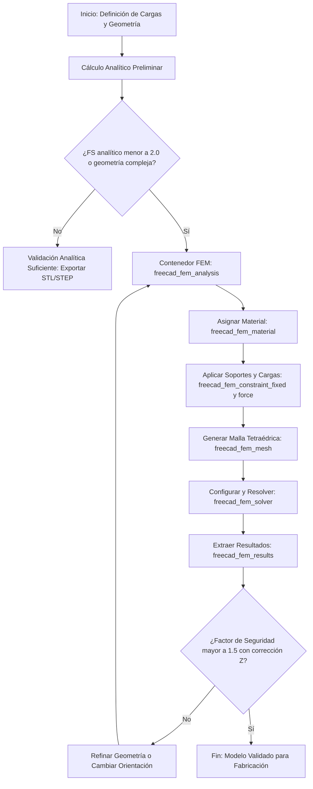

> ⚠️ **Dependencia obligatoria**: `freecad-core`. Cargar `skill(name="freecad-core")` antes de utilizar esta skill para asegurar la disponibilidad del servidor MCP y la conexión activa con FreeCAD.

# Skill: Análisis de Esfuerzos para Piezas Impresas en 3D (FreeCAD)

Esta guía establece el procedimiento determinista para evaluar la resistencia mecánica de componentes impresos en 3D, combinando estimaciones analíticas rápidas y simulación por elementos finitos (FEM) mediante las herramientas oficiales del servidor MCP de FreeCAD.

---

## 1. Flujo Principal (Dual Analítico y FEM)

---

## 2. Decisiones y Ramas (SI / ENTONCES)

| Punto de Decisión | Condición | Rama SI | Rama NO |
| :--- | :--- | :--- | :--- |
| **Evaluación Preliminar** | ¿El factor de seguridad analítico supera 2.0 en secciones simples? | Se aprueba el diseño sin simulación numérica adicional, pasando directamente a la exportación. | Se requiere validación numérica mediante simulación por elementos finitos (FEM). |
| **Complejidad Geométrica** | ¿La pieza presenta concentradores de tensión, agujeros o fillets complejos? | Se procede obligatoriamente con el pipeline FEM completo en FreeCAD. | Se puede mantener una aproximación analítica basada en secciones simplificadas. |
| **Validación de Resultados** | ¿El factor de seguridad final es menor a 1.5 tras aplicar la reducción por anisotropía Z? | Se rechaza el diseño, exigiendo rediseño geométrico o cambio en la orientación de impresión. | Se aprueba el componente para la generación del archivo de manufactura aditiva (STL). |

---

## 3. Workflow Operativo (Tool Calls Concretos)

La ejecución del análisis FEM mediante el servidor MCP se realiza invocando la secuencia estricta de herramientas especializadas:

1. **Creación del contenedor**:
   - Tool: `freecad_fem_analysis`
   - Parámetros: `name: "Analysis"`

2. **Asignación de propiedades del material**:
   - Tool: `freecad_fem_material`
   - Parámetros: `analysisName: "Analysis"`, `materialName: "Custom"`, `youngsModulus: 3500`, `poissonRatio: 0.3`, `density: 1240`, `name: "MaterialPLA"`

3. **Definición de restricciones de apoyo fijo**:
   - Tool: `freecad_fem_constraint_fixed`
   - Parámetros: `analysisName: "Analysis"`, `objectName: "Pieza"`, `references: ["Face1"]`, `name: "SoporteFijo"`

4. **Aplicación de cargas mecánicas**:
   - Tool: `freecad_fem_constraint_force`
   - Parámetros: `analysisName: "Analysis"`, `objectName: "Pieza"`, `references: ["Face3"]`, `force: 500`, `directionX: 0`, `directionY: 0`, `directionZ: -1`, `name: "CargaVertical"`

5. **Generación de malla de elementos finitos**:
   - Tool: `freecad_fem_mesh`
   - Parámetros: `analysisName: "Analysis"`, `objectName: "Pieza"`, `maxElementSize: 2.0`, `minElementSize: 0.5`, `meshOrder: 2`, `name: "MallaTetra"`

6. **Configuración y ejecución del solver**:
   - Tool: `freecad_fem_solver`
   - Parámetros: `analysisName: "Analysis"`, `solver: "calculix"`, `analysisType: "static"`, `run: true`, `name: "SolverCCX"`

7. **Extracción y lectura de resultados**:
   - Tool: `freecad_fem_results`
   - Parámetros: `analysisName: "Analysis"`

---

## 4. Gates de Validación (Obligatorios)

Cada etapa clave cuenta con un criterio de aceptación objetivo que debe cumplirse antes de avanzar:

- **Gate Analítico Preliminar**:
  - Criterio: Las fórmulas de resistencia deben arrojar tensiones máximas dentro de los límites elásticos del material.
  - Herramienta: Cálculo manual o script auxiliar.
  - Acción correctora si falla: Incrementar secciones críticas o modificar espesores base.
- **Gate de Calidad de Malla**:
  - Criterio: Conteo de elementos tetraédricos adecuado sin errores de generación en Gmsh (`meshError: null`).
  - Herramienta: `freecad_fem_mesh`.
  - Acción correctora si falla: Reducir `maxElementSize` o refinar geometría en zonas de alta curvatura.
- **Gate de Factor de Seguridad (FS)**:
  - Criterio: El factor de seguridad mínimo debe ser mayor a 1.5, aplicando un descuento del cincuenta por ciento en la resistencia admisible cuando las cargas principales soliciten el eje Z (intercapa).
  - Herramienta: `freecad_fem_results`.
  - Acción correctora si falla: Reorientar la pieza en la bandeja de impresión CAD para evitar tracción intercapa directa.

---

## 5. Tabla de Fallas Comunes

| Síntoma o Error | Causa Raíz Probable | Acción Correctiva Determinista |
| :--- | :--- | :--- |
| **El solver no converge o arroja error de matriz singular** | Falta de restricciones de contorno suficientes, permitiendo movimientos de cuerpo rígido. | Verificar que `freecad_fem_constraint_fixed` inmovilice todos los grados de libertad necesarios en la base de apoyo. |
| **Concentración excesiva de tensiones en esquinas vivas** | Ausencia de radios de acuerdo (fillets) en cambios bruscos de sección geométrica. | Aplicar `freecad_partdesign_fillet` sobre las aristas interiores antes de generar la malla FEM. |
| **Discrepancia extrema entre resultados FEM y cálculo analítico** | Malla demasiado grosera o aplicación incorrecta de las referencias de carga y soporte. | Refinar la malla disminuyendo el tamaño de elemento y comprobar las caras seleccionadas en los constraints. |

---

## 6. Anti-Patrones (Prohibido)

1. **Asumir isotropía absoluta en piezas FDM**: Tratar el material impreso como si tuviera idéntica resistencia en todas las direcciones tridimensionales.
2. **Omitir el análisis analítico previo**: Lanzar simulaciones FEM complejas sin verificar órdenes de magnitud mediante fórmulas básicas de resistencia de materiales.
3. **Aplicar cargas sobre caras intermedias del historial**: Vincular fuerzas a geometrías susceptibles de cambiar de nombre ante modificaciones paramétricas (TNP).
4. **Despreciar la dirección de laminación Z**: Diseñar componentes estructurales sometidos a tracción pura en la dirección vertical de impresión.

---

## 7. Checklist Final

- [ ] Cálculo analítico preliminar ejecutado y documentado.
- [ ] Contenedor de análisis creado con `freecad_fem_analysis`.
- [ ] Material configurado con propiedades mecánicas acordes al filamento mediante `freecad_fem_material`.
- [ ] Restricciones de soporte fijo aplicadas con `freecad_fem_constraint_fixed`.
- [ ] Cargas mecánicas aplicadas correctamente con `freecad_fem_constraint_force`.
- [ ] Malla tetraédrica generada sin errores con `freecad_fem_mesh`.
- [ ] Solver ejecutado y convergido con `freecad_fem_solver`.
- [ ] Resultados de desplazamiento y von Mises extraídos con `freecad_fem_results`.
- [ ] Factor de seguridad verificado (FS > 1.5) considerando la reducción por anisotropía Z.

---

## 8. References

- [Tabla de Materiales FDM](references/materiales-fdm.md): Propiedades mecánicas y densidad de filamentos termoplásticos.
- [Metodología de Ingeniería CAD](docs/METODOLOGIA_CAD_FREECAD.md): Estándares ISO, VDI, Shigley y fórmulas de resistencia de materiales (§9 y §10).
