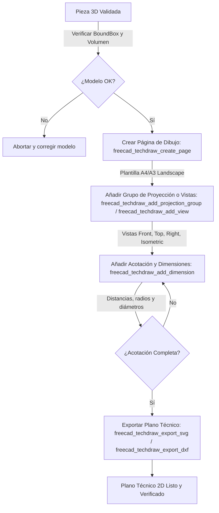

# Generación de Planos Técnicos 2D (TechDraw)

> Dependencia: freecad-core

Esta skill establece el flujo determinista y validado para generar planos técnicos 2D a partir de un sólido paramétrico validado en FreeCAD (§4.3), empleando el módulo nativo TechDraw a través del servidor MCP.

---

## 1. Flujo principal



---

## 2. Decisiones y ramas (SI/ENTONCES)

| Situación / Bifurcación | Condición | Acción / Rama a seguir |
| :--- | :--- | :--- |
| **Validación previa del modelo** | BoundBox o volumen inválidos o nulos | **SI** el modelo tiene errores topológicos, **ENTONCES** abortar la generación del plano y corregir el sólido base (§4.3). |
| **Elección de formato de hoja** | Pieza de gran tamaño o múltiples vistas | **SI** la pieza requiere detalle complejo, **ENTONCES** usar plantilla `A3_Landscape` o `A2_Landscape`; caso contrario, usar `A4_Landscape`. |
| **Proyección de vistas** | Necesidad de vistas ortogonales estándar | **SI** se requiere un plano estándar de fabricación, **ENTONCES** usar `freecad_techdraw_add_projection_group` con vistas `["Front", "Top", "Right"]`. |
| **Formato de salida** | Destino del plano técnico | **SI** se requiere vector web o impresión directa, exportar SVG; **SI** se requiere integración CAD/CAM externo, exportar DXF. |

---

## 3. Workflow operativo (tool calls concretos)

Secuencia exacta de ejecución mediante las herramientas MCP de TechDraw:

1. **Crear página de dibujo**:
   ```json
   {
     "name": "freecad_techdraw_create_page",
     "arguments": {
       "template": "A4_Landscape",
       "name": "PlanoFabricacion"
     }
   }
   ```

2. **Añadir grupo de proyección multiparte**:
   ```json
   {
     "name": "freecad_techdraw_add_projection_group",
     "arguments": {
       "pageName": "PlanoFabricacion",
       "objectName": "Tip",
       "views": ["Front", "Top", "Right"],
       "scale": 1.0,
       "name": "ProyeccionPrincipal"
     }
   }
   ```

3. **Añadir vista isométrica complementaria**:
   ```json
   {
     "name": "freecad_techdraw_add_view",
     "arguments": {
       "pageName": "PlanoFabricacion",
       "objectName": "Tip",
       "direction": "Isometric",
       "scale": 1.0,
       "x": 180,
       "y": 50,
       "name": "Isometrica"
     }
   }
   ```

4. **Acotar cotas críticas y diámetros**:
   ```json
   {
     "name": "freecad_techdraw_add_dimension",
     "arguments": {
       "pageName": "PlanoFabricacion",
       "viewName": "Front",
       "dimensionType": "distance",
       "edge": "Edge1",
       "name": "CotaAncho"
     }
   }
   ```

5. **Exportar a SVG o DXF**:
   ```json
   {
     "name": "freecad_techdraw_export_svg",
     "arguments": {
       "pageName": "PlanoFabricacion",
       "filePath": "/home/fciliberti/Trabajos/Tools/freecad-mcp/output/plano.svg"
     }
   }
   ```

---

## 4. Gates de validación (obligatorios)

- **Gate de Vistas y Escala**:
  - *Criterio objetivo*: Las vistas ortogonales deben reflejar exactamente la geometría del Tip actual, manteniendo la escala declarada (ej. 1:1 o 1:2) sin solapamientos en la hoja.
  - *Tool requerida*: `freecad_get_object_info` o inspección de propiedades del grupo de proyección.
  - *Acción si falla*: Ajustar el parámetro `scale` o reposicionar las vistas mediante coordenadas `x`/`y`.

- **Gate de Acotación Completa**:
  - *Criterio objetivo*: Todas las dimensiones críticas de fabricación (anchos, alturas, profundidades y agujeros) deben estar acotadas sin ambigüedades geométricas.
  - *Acción si falla*: Agregar las cotas faltantes con `freecad_techdraw_add_dimension`.

---

## 5. Tabla de fallas comunes

| Falla / Síntoma | Causa raíz | Mitigación / Solución |
| :--- | :--- | :--- |
| **Error "Page not found"** | El nombre de la página pasado como argumento no coincide con el creado. | Verificar el nombre exacto devuelto por `freecad_techdraw_create_page`. |
| **Plantilla SVG no encontrada** | Ruta de recursos de TechDraw no accesible en el entorno de FreeCAD. | Asegurar que FreeCAD esté correctamente instalado y que el template use los nombres válidos (`A4_Landscape`, etc.). |
| **Dimensiones desvinculadas** | Referencias a vértices o aristas obsoletas tras modificar el modelo 3D. | Recomputar el documento y recrear las dimensiones sobre las aristas actuales del Tip. |

---

## 6. Anti-patrones (PROHIBIDO)

- **PROHIBIDO** generar planos de piezas cuyo sólido base no haya pasado la validación de BoundBox y volumen (§4.3).
- **PROHIBIDO** mezclar anotaciones manuales arbitrarias sin referencias a elementos geométricos reales del modelo.
- **PROHIBIDO** exportar archivos a rutas relativas o directorios del sistema no permitidos por `validateFilePath()`.

---

## 7. Checklist final

- [ ] Sólido 3D validado en su Tip definitivo.
- [ ] Página de dibujo creada con plantilla adecuada (`A4_Landscape` o superior).
- [ ] Grupo de proyección ortogonal configurado correctamente.
- [ ] Vista isométrica añadida para referencia visual.
- [ ] Cotas principales añadidas y verificadas.
- [ ] Exportación a SVG / DXF completada con éxito en ruta absoluta.

---

## 8. References

- `src/tools/techdraw.ts`
- `docs/METODOLOGIA_CAD_FREECAD.md`
- `docs/GUIA_BUENAS_PRACTICAS_CAD.md`
