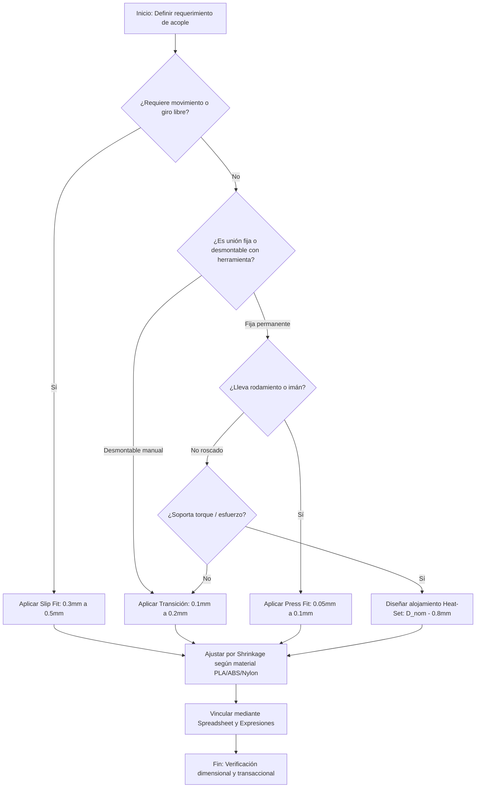

> ⚠️ **Dependencia obligatoria**: Esta skill requiere la skill base **`freecad-core`** y el servidor MCP `freecad` activo.

# Skill: freecad-tolerances

Estándar de ingeniería para tolerancias en fabricación aditiva (FDM) y gestión paramétrica en FreeCAD.

---

## 1. Flujo principal (Mermaid graph TD)

---

## 2. Decisiones y ramas (SI/ENTONCES)

| Condición del Acople | Selección Técnica | Parámetro en CAD |
|----------------------|-------------------|------------------|
| Giro libre / Eje rotatorio | Slip Fit | `Eje + 0.4mm` (holgura radial) |
| Encastre manual / Tapa | Transición | `Cota nominal + 0.15mm` |
| Rodamiento 608 / Imán | Press Fit | `Alojamiento - 0.08mm` (interferencia) |
| Rosca desmontable alta resistencia | Inserto Heat-Set | `D_taladro = D_nominal - 0.8mm` |

---

## 3. Workflow operativo (Tool calls concretos)

Secuencia transaccional obligatoria para aplicar tolerancias paramétricas:

1. **Iniciar transacción y snapshot**:
   - `freecad_begin_transaction({name: "aplicar_tolerancias"})`
   - `freecad_snapshot_document({})`
2. **Crear hoja de parámetros globales**:
   - `freecad_spreadsheet_create({name: "Parametros"})`
   - `freecad_spreadsheet_set({sheetName: "Parametros", cells: [{cell: "A1", value: "0.4"}, {cell: "A2", value: "0.08"}, {cell: "A3", value: "1.0"}]})`
   - `freecad_spreadsheet_alias({sheetName: "Parametros", cell: "A1", alias: "holgura_slip"})`
   - `freecad_spreadsheet_alias({sheetName: "Parametros", cell: "A2", alias: "holgura_press"})`
   - `freecad_spreadsheet_alias({sheetName: "Parametros", cell: "A3", alias: "offset_inserto"})`
3. **Vincular croquis con expresiones**:
   - `freecad_set_expression({objectName: "Sketch", property: "Constraints[2]", expression: "Eje.Radius + Spreadsheet.holgura_slip"})`
4. **Crear alojamientos de insertos (si aplica)**:
   - `freecad_hole({sketchName: "SketchAgujero", diameter: 2.2, depth: 6.0, holeType: "simple"})`
5. **Validar cambios mediante diff**:
   - `freecad_diff_snapshot({snapshotA: "...", snapshotB: "...", expectedChanges: ["Parametros", "Sketch"]})`
6. **Confirmar transacción**:
   - `freecad_commit_transaction({})` (o `freecad_abort_transaction({})` si hay regresión).

---

## 4. Gates de validación (obligatorios)

1. **Gate Dimensional (Holgura FDM)**:
   - *Criterio*: La holgura mínima entre superficies móviles no debe ser inferior a `0.3mm`.
   - *Tool*: Inspección mediante `freecad_diff_snapshot` y verificación numérica.
   - *Acción si falla*: Reasignar cota en la hoja `Parametros` y recomputar.
2. **Gate de Contracción**:
   - *Criterio*: Materiales con alta contracción (ABS/Nylon) deben compensar la cota nominal con factor porcentual en el modelo o slicer.
   - *Tool*: `freecad_spreadsheet_get`.
   - *Acción si falla*: Actualizar variable de shrinkage en la hoja de parámetros.

---

## 5. Tabla de fallas comunes

| Síntoma / Error | Causa Raíz | Mitigación Obligatoria |
|-----------------|------------|------------------------|
| El eje impreso no gira o se traba | Uso de tolerancias de CNC (H7/g6 de 0.01mm) | Aplicar Slip Fit FDM (`0.3mm` a `0.5mm`) |
| El inserto de bronce queda ladeado o bota plástico | Diámetro de taladro incorrecto o profundidad insuficiente | Usar fórmula `D_nominal - 0.8mm` y profundidad mayor en `1.0mm` |
| La pieza encaja suelta o con juego excesivo | Ausencia de compensación de contracción (shrinkage) para ABS/Nylon | Incorporar factor de contracción del polímero en la hoja `Parametros` |

---

## 6. Anti-patrones (PROHIBIDO)

- **PROHIBIDO** usar tolerancias cerradas de micras (menores a `0.05mm`) para acoples móviles FDM.
- **PROHIBIDO** roscar directamente plástico impreso en diámetros inferiores a M6 sin inserto heat-set.
- **PROHIBIDO** hardcodear valores de tolerancia directamente en los croquis en lugar de usar la hoja `Parametros`.

---

## 7. Checklist final

- [ ] Hoja `Parametros` creada y vinculada mediante `freecad_set_expression`.
- [ ] Ajuste seleccionado según la función mecánica (Slip, Transición o Press Fit).
- [ ] Alojamientos de insertos calculados con la fórmula estándar de la skill.
- [ ] Transacción cerrada correctamente tras verificar el diff estructural.

---

## 8. References

Ver detalles completos en [references/ajustes-fdm.md](references/ajustes-fdm.md).
